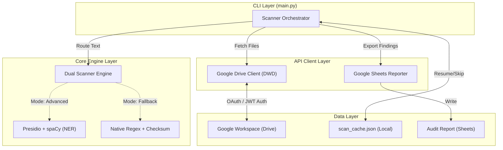
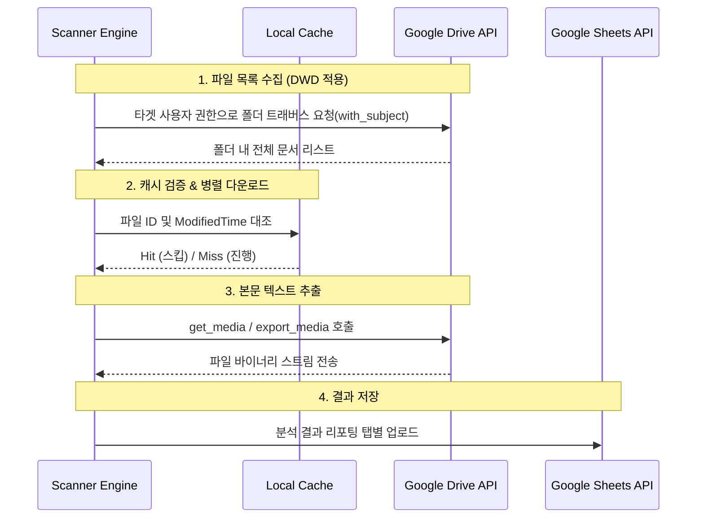

# [Technical Spec] Google Drive PII/NPI 자동 탐지 스캐너 (Security Scanner)

본 문서는 사내 Google Drive 상의 민감 정보(PII 및 NPI)를 식별, 분류하여 리포팅하는 **AI-Powered Security Scanner**의 기술 사양서입니다.

---

## 1. 전체 아키텍처

본 시스템은 외부 C++ 의존성 문제에 유연하게 대처할 수 있는 **Dual-Engine (Presidio + Native Regex)** 아키텍처와, 사용자 단말이 아닌 백그라운드 환경에서도 독립 동작 가능한 **Domain-Wide Delegation (DWD)** 구조를 채택한 순수 파이썬(Python) 기반의 CLI 애플리케이션입니다.



### 레이어 설명

| Layer | 역할 | 기술 스택 |
| --- | --- | --- |
| **CLI / Controller** | 병렬 처리 스케줄링(ThreadPool), 진행 상태 표시 | Python 3.9+, `concurrent.futures`, `tqdm` |
| **Core Engine** | 텍스트 청킹, 정규식 매칭, Luhn/체크섬 검증 | `presidio-analyzer`, `spaCy`, `re` |
| **API Client** | 구글 API 통신, 소켓 에러 제어, DWD 가장 | `google-api-python-client`, `httplib2`, `threading.local` |
| **Data / Storage** | 중단 시 이어하기 캐시, 최종 결과물 | JSON, Google Sheets API v4 |

---

## 2. 외부 API 연동 구조

### 2.1 인증 및 데이터 수집 흐름

관리자 승인 기반의 서비스 계정(Service Account) JWT 방식을 활용하여 사용자 개입 없는 자동화 스캔 흐름을 진행합니다.



| 서비스 | 인증 방식 | 사용 권한 (Scopes) |
| --- | --- | --- |
| **Google Drive API** | Service Account + JWT (DWD) | `https://www.googleapis.com/auth/drive.readonly` |
| **Google Sheets API** | Service Account (Direct) | `https://www.googleapis.com/auth/spreadsheets` |

### 2.2 네트워크 안정성 (Retry & Thread-Safety)

- **Thread-Safety**: `httplib2`의 쓰레드 충돌 및 OS 소켓 데드락 방지를 위해 `threading.local()` 기반으로 Worker별 독립 API 클리언트 객체를 생성합니다.
- **Auto-Retry**: 대규모 탐색 중 빈번히 발생하는 `[WinError 10054]`에 대응하기 위해 지수 백오프(Exponential Backoff)를 수반한 재시도 로직을 탑재했습니다.

---

## 3. 데이터 모델 및 스토리지

별도의 RDBMS 없이 경량화된 로컬 캐시와 Google Sheets를 결합하여 상태를 영속화합니다.

### 3.1 scan_cache.json (Local State)

네트워크 단절 시 방대한 스캔을 처음부터 다시 시작하지 않도록 하는 진행도 세이브파일입니다.
- **Key 구조**: `file_id`
- **Value 구조**: `{ modified_time, total_chars, findings (마스킹된 탐지 데이터), error }`

### 3.2 Audit Report (Google Sheets)

발견된 모든 잠재적 위험 정보를 3가지 뷰(View)로 요약하여 리포팅합니다.
- **Summary**: 스캔에 소요된 시간, 검사 파일 수, 위험도 분류별 통계
- **Flagged Files**: 조건에 적발된 파일들의 접근 링크 및 파일별 최고 위험도(Risk Level)
- **All Findings**: 파일 단위가 아닌 발견된 민감정보(Entity) 단위의 원장 (마스킹 처리됨)

---

## 4. 핵심 로직: Dual-Engine PII 탐지

Python 환경에 따라 C++ 빌드 툴 없이도 스캔이 가능하도록 설계된 적응형(Adaptive) 엔진입니다.

| 분류 (Entity) | 탐지 조건 및 알고리즘 | 보안 조치 (Masking) |
| --- | --- | --- |
| **국내 주민번호(KR_RRN)** | 13자리 숫자 추출 후 **공식 체크섬 함수** 통과 여부 검증 | `9201**-*******` |
| **미국 NPI / US_SSN** | 정규표현식 매칭 후 **Luhn 알고리즘** 통과 여부 검증 | `1******3` |
| **신용카드(CREDIT_CARD)** | 국제 카드 / 국내 카드 공통 13~19자리 및 **Luhn 알고리즘** 식별 | `4***-****-****-1234` |
| **기타 일반 정보** | 이메일(`EMAIL_ADDRESS`), 전화번호(`KR_PHONE`) 정규식 매칭 | `h***@daangn.com` |
| **주변어(Context) 부스팅** | 탐지된 문자열 앞뒤 50글자 내에 지정된 키워드(예: '여권', 'NPI') 존재 시 신뢰도(Confidence) 점수 +0.15 부여 | - |

---

## 5. UI 및 터미널 UX 경험

### 5.1 CLI 컴포넌트

- **Tqdm Progress Bar**: 전체 파일 개수 대비 캐시 스킵 개수를 고려하여 실시간 스캔 % 진행률 렌더링.
- **Log Tracer**: 탐색 중인 드라이브 폴더의 현재 뎁스(Depth) 및 경로를 콘솔에 실시간 출력하여 병목 구간 식별.

---

## 6. 프로젝트 디렉터리 구조 

```
google-drive-npi-information-scan/
├── main.py                  # CLI 엔트리포인트 & 스케줄러 (캐시 제어 포함)
├── scanner_engine.py        # PII 탐지 로직 (Presidio & Native Python Matcher)
├── drive_client.py          # Google Drive API 통신 (DWD & Thread-local 적용)
├── file_extractor.py        # Mime Type별 파일 바이너리 → 시맨틱 텍스트 파서
├── korean_recognizer.py     # 한국형 개인정보 (주민/여권/전화) Validator
├── npi_recognizer.py        # 미국 의료/보험/SSN Validator
├── reports/                 # 로컬 백업용 JSON 결과물 디렉터리
├── scan_cache.json          # 스캔 진행 상태 실시간 영속화 파일
└── config.py                # .env 기반 환경 변수 매핑 (.env.example 포함)
```
